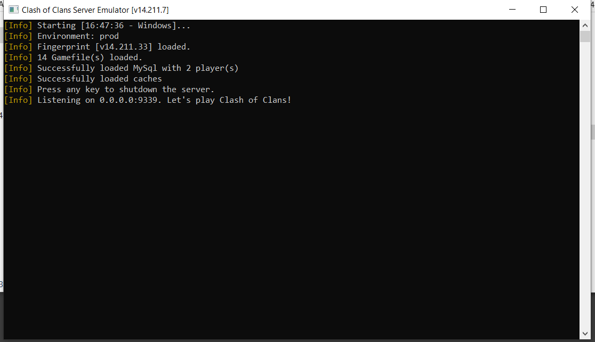

# CoC v14 Server
[](https://clash-royale.en.uptodown.com/android/download/1632865)


## 📦 Requirements:
  - [.NET Core SDK 3.1 and runtime ](https://dotnet.microsoft.com/download/dotnet-core/3.1)
  - [MySql Database WAMP Server with PhpMyAdmin](https://wampserver.aviatechno.net/?lang=en=)
- APK signing tool
- Basic knowledge of APK modification

## 🖥️ Sunucu Kurulumu:
---
1️⃣ Building the Project

You can either build the project yourself or use the prebuilt release version.
.NET Core 3.1 must be installed.

2️⃣ WAMP & Database Setup
1) Start WAMP Server and open PhpMyAdmin
2) User: root, Password: (leave blank)
3) Create a new database: mysql_database (magic-database)

⚠️ Make sure the database name matches the one in config.json.
Check the config.json file inside the server software:
---

```json
{
  "encryption_key": "fhsd6f86f67rt8fw78fw789we78r9789wer6re",
  "encryption_nonce": "nonce",
  "mysql_database": "magic-database",
  "mysql_password": "",
  "mysql_server": "127.0.0.1",
  "mysql_user": "root",
  "server_port": 9339,
  "environment": "prod",
  "update_url": "https://github.com/"
}
```
Run the magic-database.sql query inside the GameAssets folder.
Run ClashofClans.exe.

If you see the server screen:



---

## 📜 Legal & Disclaimer

This repository is created in accordance with **Supercell's Fan Content Policy**.

🔗 https://supercell.com/en/fan-content-policy/

- This project is **not affiliated with, endorsed, sponsored, or approved by Supercell**.
- All game assets belong to their respective owners.
- This repository is intended for **non-commercial fan and educational use only**.

---

---
## ⭐ Support

If you find this project useful, consider giving it a star ⭐ to support development.
---